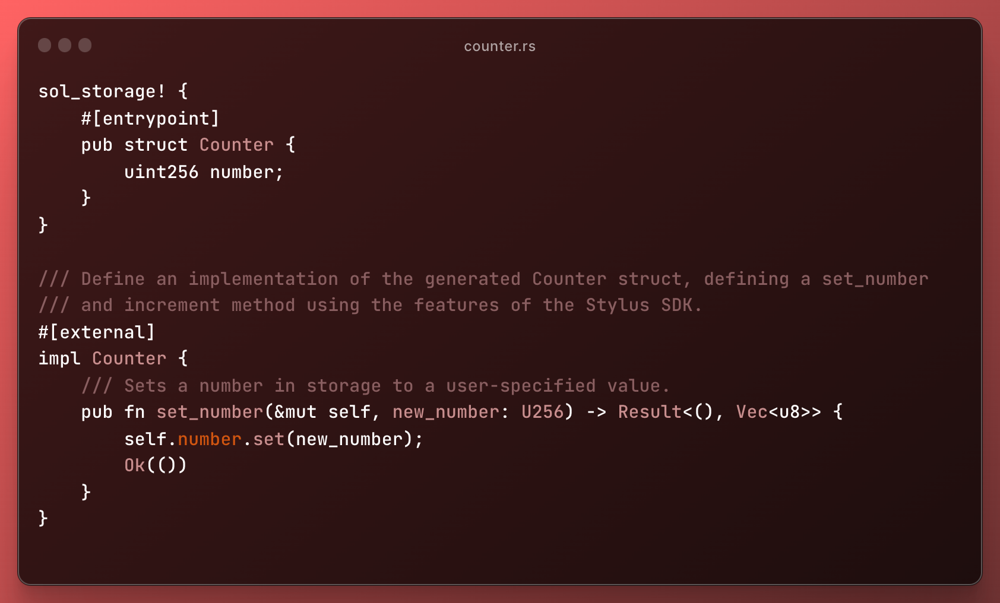

# Tswarp CLI



🚀 **Tswarp CLI** is a powerful tool that simplifies the process of converting TypeScript code to Stylus Rust and managing Stylus Rust projects. With just a few commands, you can initialize projects, compile TypeScript to Stylus Rust, and validate Stylus Rust projects using `cargo stylus check`.

---

## Requirements

Before using `tswarp`, ensure your environment is properly set up with the following:

### 1. **Rustup**
Install Rustup, the Rust toolchain installer:
```bash
curl --proto '=https' --tlsv1.2 -sSf https://sh.rustup.rs | sh
```

### 2. **Cargo**
Cargo is the Rust package manager and is included with Rustup.

### 3. **Add the WASM Compilation Target**
Add the WebAssembly (WASM) target for Rust:
```bash
rustup target add wasm32-unknown-unknown
# Verify it's installed
rustup target list --installed | grep wasm
```

### 4. **Install `cargo-stylus`**
Install the `cargo-stylus` package for Stylus Rust validation:
```bash
cargo install --force cargo-stylus
# Quick check to ensure it's installed
cargo stylus --version  # Should show 0.4.0 or newer
```

---

## Setting Up Your Local Development Environment

To set up a local Stylus Rust development environment, follow these steps:

1. **Clone the Devnode Repository**
```bash
git clone https://github.com/OffchainLabs/nitro-devnode.git
cd nitro-devnode
```

2. **Launch Your Local Arbitrum Chain**
```bash
./run-dev-node.sh
```

---

## Installation

### Install the CLI via NPM
Install the `tswarp` CLI globally via npm:
```bash
npm install -g tswarp
```

You can now use `tswarp` as a global command.

---

## Usage

### Commands

#### 1. **Initialize a New Project**
```bash
tswarp init <projectname>
```
- **Description**: Creates a new project with a TypeScript converter and Stylus Rust logic templates.
- **Example**:
  ```bash
  tswarp init myproject
  ```
- **Result**:
  - A new directory `myproject` is created.
  - TypeScript templates are placed under `converter/`.
  - Stylus Rust templates are placed under `logic/`.

#### 2. **Compile TypeScript to Stylus Rust**
```bash
tswarp compile
```
- **Description**: Compiles the TypeScript files in the `converter` directory into Stylus Rust code.
- **Note**: This command should be run **inside the `converter` directory**.
- **Example**:
  ```bash
  cd converter
  tswarp compile
  ```

#### 3. **Run `cargo stylus check`**
```bash
tswarp build
```
- **Description**: Runs the `cargo stylus check` command in the current directory to validate Stylus Rust projects.
- **Note**: This command should be run **inside the `logic` directory**.
- **Example**:
  ```bash
  cd logic
  tswarp build
  ```

#### 4. **View CLI Version**
```bash
tswarp --version
```
- **Description**: Displays the current version of the Tswarp CLI.
- **Example**:
  ```bash
  tswarp --version
  ```

#### 5. **View Help Information**
```bash
tswarp --help
```
- **Description**: Shows the help menu with a list of all available commands.
- **Example**:
  ```bash
  tswarp --help
  ```

---

## Project Structure

When you initialize a new project with `tswarp init <projectname>`, the following structure is created:

```
<projectname>/
├── converter/                 # TypeScript project
│   ├── counter.ts             # TypeScript example file
│   ├── package.json           # Node.js package configuration
│   └── node_modules/          # Node.js dependencies
├── logic/                     # Stylus Rust project
│   ├── Cargo.toml             # Stylus Rust package configuration
│   ├── Cargo.lock             # Stylus Rust dependencies lock file
│   ├── rust-toolchain.toml    # Stylus Rust toolchain configuration
│   ├── src/                   # Stylus Rust source code
│   │   ├── main.rs            # Main Stylus Rust entry point
│   │   └── lib.rs             # Stylus Rust library code
│   └── examples/              # Example Stylus Rust files
│       └── counter.rs
```

---

## Development Workflow

### Initializing a Project
1. **Create a New Project**:
   ```bash
   tswarp init myproject
   ```

2. **Navigate to the Project Directory**:
   ```bash
   cd myproject
   ```

### Compiling TypeScript to Stylus Rust
1. **Run the Compiler**:
   ```bash
   cd converter
   tswarp compile
   ```

2. **Check the Generated Stylus Rust Files**:
   - Output files will be added to the Stylus Rust `logic` directory.

### Validating Stylus Rust Code
1. **Run `cargo stylus check`**:
   ```bash
   cd logic
   tswarp build
   ```

2. **Fix Any Stylus Rust Issues**:
   - Review and fix any warnings or errors reported by the `cargo stylus check` command.

---

## Contributing

Contributions are welcome! Please follow these steps:

1. Fork this repository.
2. Create a new branch for your feature or bug fix.
3. Commit your changes with clear messages.
4. Submit a pull request.

---

## License

This project is licensed under the [MIT License](LICENSE). See the `LICENSE` file for details.

---

## Acknowledgments

- **Stylus Rust**: The powerful toolchain for systems programming.
- **TypeScript**: A strongly typed programming language for JavaScript.
- **Node.js**: The runtime for running the CLI.

Enjoy using Tswarp CLI! 🚀
